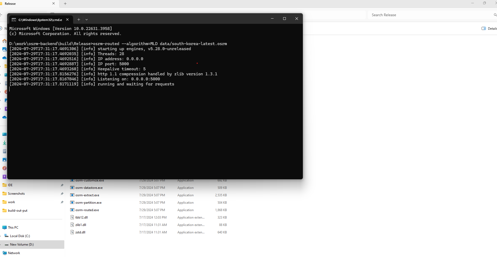

# Running OSRM Backend on Windows

## Building Instructions

Refer to the [BUILDING.md](BUILDING.md) document for detailed steps on compiling OSRM from the source code.

Once you've built OSRM, you can find the output in this repository. The following instructions will guide you through setting up a local OSRM backend server on your Windows environment.

## Getting Started Quickly

1. **Download and Prepare OSM Data**

   Obtain OpenStreetMap (OSM) data and ready it for OSRM usage. Download the data from [Geofabrik](https://download.geofabrik.de/) or your preferred OSM data source.
   
   - For demonstration purposes, we're using the most recent South Korean map data from Geofabrik, which is stored in the repository's data folder.

2. **Set Up the Profile File**

   Use the existing 'car.lua' file from the source code or craft a new profile.
   
   - This guide employs the 'car.lua' file found in the original source. We've rectified an integer number bug, as documented in the [BUILDING.md](BUILDING.md) file.

3. **Select Pre-Processing Pipelines and Execute Commands in CMD**

   Familiarize yourself with the pre-processing pipelines by visiting the OSRM Backend Project Wiki.

   - For the MLD pipeline:
     
     Extract a graph from the OSM base map using `osrm-extract`, partition it into cells with `osrm-partition`, customize routing weights with `osrm-customize`, and launch the development HTTP server `osrm-routed`:

     ```bash
     cd osrm-backend-build-output
     osrm-extract data/south-korea-latest.osm.pbf
     osrm-partition data/south-korea-latest.osrm
     osrm-customize data/south-korea-latest.osrm
     osrm-routed --algorithm=MLD data/south-korea-latest.osrm
     ```

   - For CH (Contraction Hierarchies):
     
     Replace the partition and customize stages with `osrm-contract` to apply shortcuts:

     ```bash
     osrm-extract data/south-korea-latest.osm.pbf -p profiles/car.lua
     osrm-contract data/south-korea-latest.osrm
     osrm-routed data/south-korea-latest.osrm
     ```

After a successful setup, your local OSRM backend server will be operational, as depicted in the image below:


